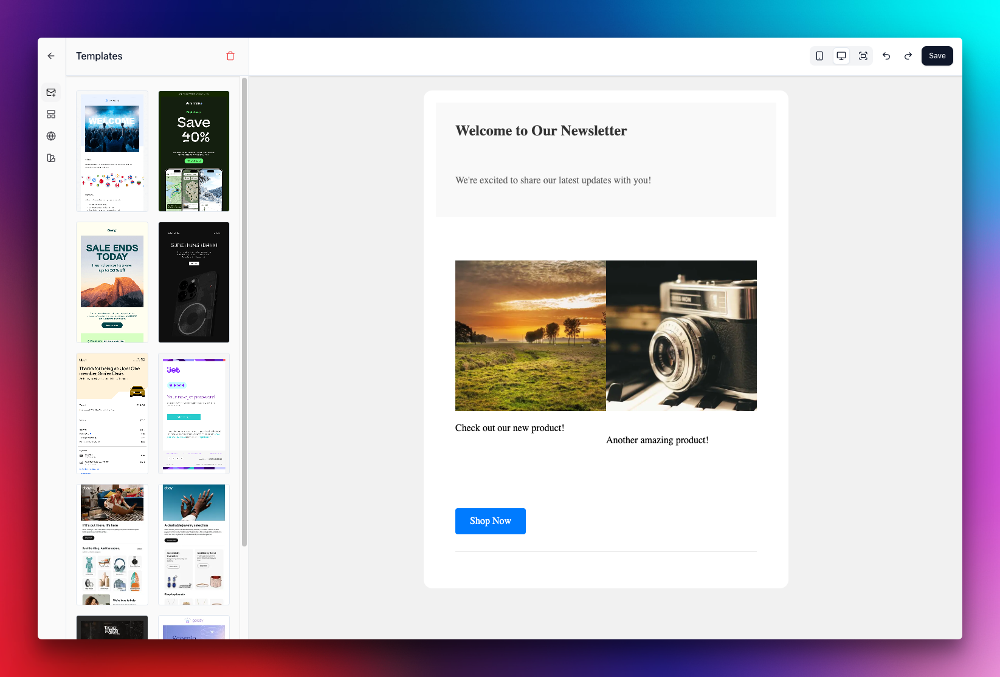

# Email Editor
> Email Editor is a simple email editor for creating and previewing emails.



## Stack

- Vite
- TypeScript
- React
- TailwindCSS
- Shadcn/UI
- Semantic Release
- Commitizen
- Conventional Commits
- Lint-staged
- Github Actions
- Bun

## Installation

You can install it with npm (don't expect much fanciness):

```bash
npm i
# or
bun i
```

## Development

```bash
npm run dev
# or
bun run dev
```

## Build

```bash
npm run build
# or
bun run build
```

## Publish

Add this to your `.releaserc.json`:

```json
{
  "branches": ["main"],
  "plugins": [
    "@semantic-release/commit-analyzer",
    "@semantic-release/release-notes-generator",
    [
      "@semantic-release/npm",
      {
        "npmPublish": false
      }
    ],
    [
      "@semantic-release/git",
      {
        "assets": ["package.json"],
        "message": "chore(release): ${nextRelease.version} [skip ci]\n\n${nextRelease.notes}"
      }
    ],
    "@semantic-release/github"
  ]
}
```

Push to main to trigger a release.

Run publish directly:

```bash
npm run publish
# or
bun run publish
```

## Usage

```javascript
import { EmailEditor } from "email-editor";


<EmailCanvas
  onSave={(htmlTemplate, jsonTemplate, reactComponent) => {
    // Do whatever you want with html, json and react template
  }}
  onBack={() => {
    // Redirect back to where ever you want
  }}
  template={jsonTemplate} // Optional
/>
```
